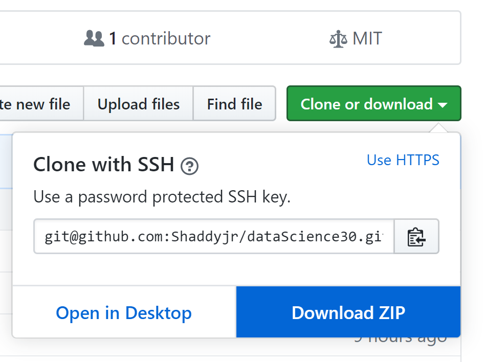

# dataScience30
## [Day 1: Introduction](https://youtu.be/p5vm1ktJA3c)
#### By [Glitched Failure](https://www.youtube.com/channel/UCErSNiDZV4rJCNB8NrDGREA)
---
## Objectives
- Participants will know what to expect from the course.

## Assignments
- Download the course material at - https://github.com/Shaddyjr/dataScience30
    - If you're familiar with GitHub, feel free to fork and clone the repo
    - Otherwise, you can download the zip file (you'll have to extract the contents)
    
- If you need to learn how to program in Python, or could use a refresher, please use any of the courses found here - ["5 Free Courses to Learn Python in 2019"](https://medium.com/swlh/5-free-python-courses-for-beginners-to-learn-online-e1ca90687caf)

## Have Feedback?
[Submit feedback here](https://docs.google.com/forms/d/e/1FAIpQLScvsDT2Q2VH26FvvfQhjNmP4RwXqh9GWiKSIcTFAHdfCKZdlg/viewform?usp=sf_link)